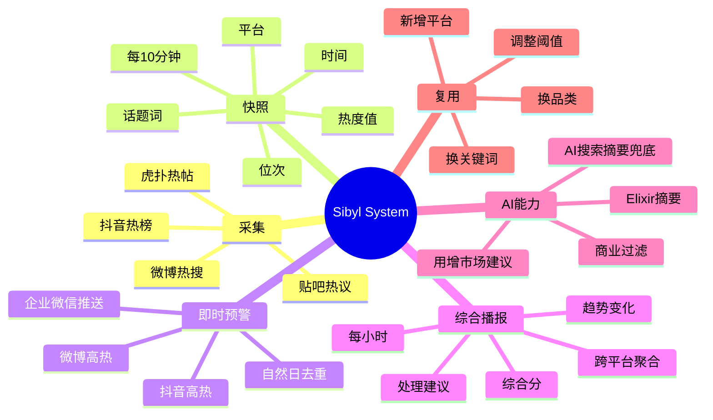
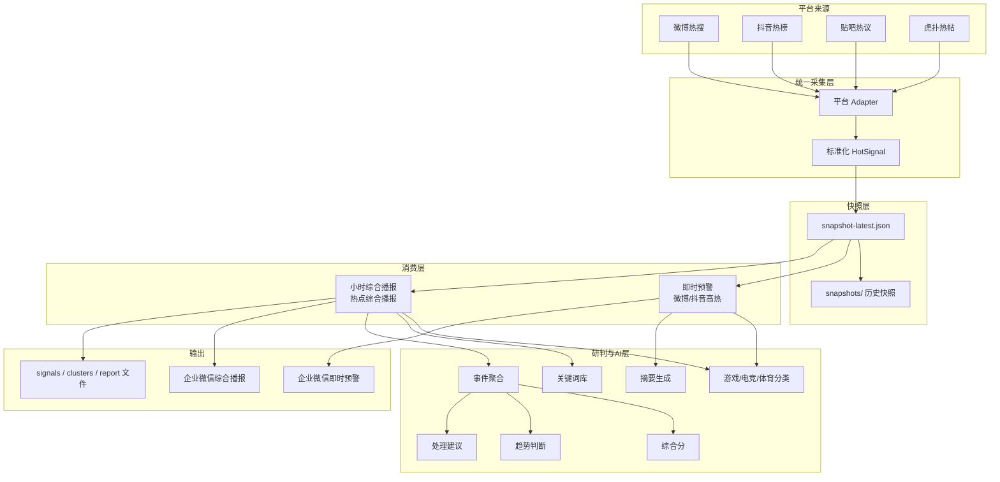
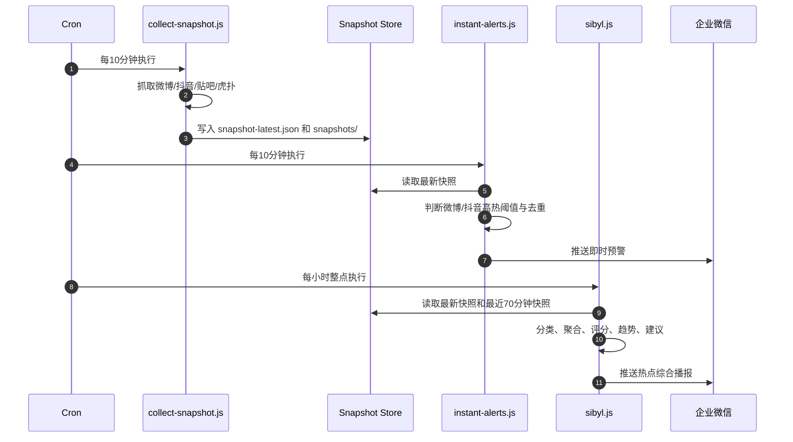
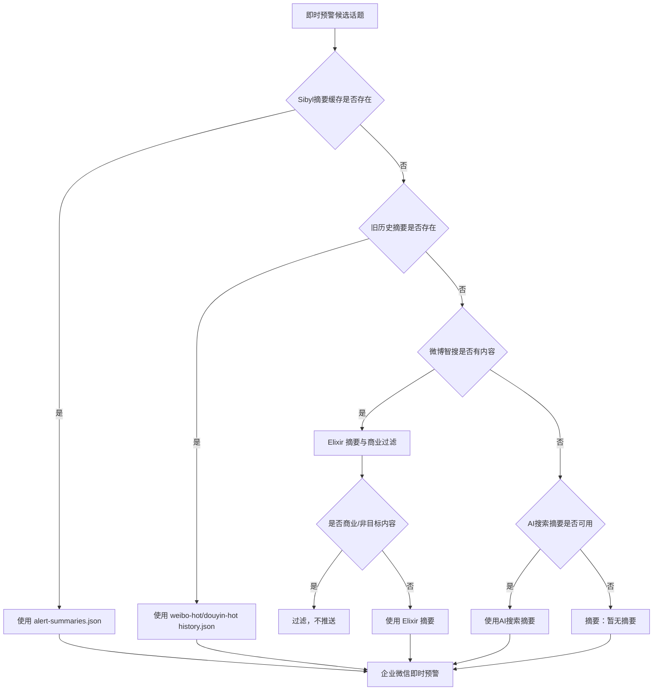
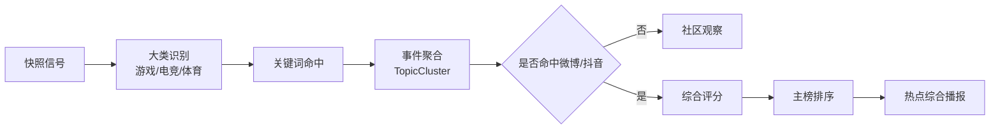

# Sibyl System 产品文档

版本：1.2.5
日期：2026-06-22
作者：Misaka Studio
适用对象：部门内部分享、OpenClaw 技能复用、热点监控方案评审

---

## 1. 一句话介绍

Sibyl System 是一个多平台热点信号聚合与趋势研判系统。它每 10 分钟统一采集微博、抖音、贴吧、虎扑热点数据，保留微博/抖音高热即时预警，并每小时生成一次面向用增市场阅读者的“热点综合播报”。

系统目标不是替代人工判断，而是把分散、重复、噪音较高的平台热榜信号整理成更适合快速阅读和决策的结构化信息。

---

## 2. 背景与问题

在 Sibyl System 之前，微博监控和抖音监控分别运行，各自抓取、筛选、摘要和推送。这种方式能解决单平台高热预警，但有几个明显问题：

- 重复抓取：微博、抖音各自抓取，Sibyl 综合播报再抓一次，容易增加失败率和风控风险。
- 口径不一致：单平台预警和综合播报可能基于不同时间点的数据，趋势判断不稳定。
- 阅读负担高：平台热榜信息密集，缺少跨平台合并、趋势说明和处理建议。
- 社区信号价值分散：虎扑、贴吧单独作为主榜价值有限，但作为补充信号能帮助判断垂类热度。
- AI 使用边界不清：摘要、建议和搜索兜底如果没有明确约束，容易出现不相关或臆测内容。

Sibyl System 的设计出发点是：统一采集底座，分层消费数据，让即时预警和综合播报共用同一份热点快照。

---

## 3. 产品目标

### 3.1 核心目标

- 降低热点筛选和阅读成本。
- 统一微博、抖音、贴吧、虎扑的监控数据口径。
- 保留高热即时预警能力，避免重要热点等到小时报才出现。
- 通过小时内采样记录，提供更可信的趋势判断。
- 输出适合企业微信阅读的结构化播报。

### 3.2 目标用户

- 用增市场：判断热点是否适合作为当日首消内容入口。
- 内容/活动相关同学：快速识别值得承接的话题和素材方向。
- 业务观察者：了解游戏、电竞、体育领域的热点变化和平台分布。
- 其他团队：复用多平台热点采集、快照、即时预警和综合播报框架。

### 3.3 不做什么

- 不覆盖全网所有热点。
- 不播报非游戏、非电竞、非体育内容。
- 不把 AI 摘要或 AI 建议作为事实唯一来源。
- 不替代人工判断，只提供排序、趋势和初步承接建议。
- 不让虎扑、贴吧单独主导综合播报；它们默认是补充信号。

---

## 4. 功能总览



---

## 5. 整体架构



---

## 6. 数据流与运行机制

### 6.1 运行节奏

Sibyl System 分为两条定时链路：

- 每 10 分钟：采集快照，并检查微博/抖音即时高热预警。
- 每 60 分钟：读取最近快照和历史采样，生成热点综合播报。



### 6.2 快照字段

每条快照记录至少包含：

```json
{
  "platform": "douyin",
  "platformLabel": "抖音",
  "capturedAt": "2026-06-18T10:10:00.000Z",
  "topic": "世界杯还需要内马尔吗",
  "normalizedTopic": "世界杯还需要内马尔吗",
  "rank": 7,
  "heat": 9050000,
  "heatText": "905万",
  "url": "https://www.douyin.com/search/...",
  "sourceType": "hot_board",
  "board": null
}
```

快照文件位置：

```text
/root/.openclaw/workspace/data/sibyl/
├── snapshot-latest.json
├── snapshots/
├── alerts-state.json
├── alert-summaries.json
├── signals-latest.json
├── clusters-latest.json
├── report-latest.md
└── state.json
```

---

## 7. 设计逻辑

### 7.1 为什么要统一快照

统一快照是 Sibyl System 的底座。它解决的是“同一时间点的多平台事实”问题。

如果微博、抖音即时预警和综合播报分别抓取，就会出现：

- 同一话题在不同链路看到的排名不同。
- 小时报趋势只能粗略比较上一小时，无法知道小时内最高点。
- 抓取次数增加，平台接口失败和风控风险增加。

统一快照后：

- 即时预警和小时播报共用同一份数据。
- 小时报能基于 10 分钟采样计算趋势。
- 未来复盘可以回看历史快照。

### 7.2 为什么微博/抖音是播报种子

微博和抖音分别代表泛舆论场和短视频扩散场，更适合作为“是否进入主播报”的门槛。

贴吧和虎扑不是没有价值，而是价值更偏垂类社区：

- 虎扑适合补充体育、电竞讨论强度。
- 贴吧适合补充兴趣社区讨论和早期垂类信号。
- 单虎扑或单贴吧话题容易过窄，不适合直接进入综合主榜。

因此综合播报默认要求：话题必须命中微博或抖音之一；贴吧、虎扑作为补充、加分和社区观察。

### 7.3 为什么先按大类，再用关键词

Sibyl System 的监控范围是游戏、电竞、体育。筛选逻辑分两层：

1. 大类命中：判断是否属于游戏、电竞、体育。
2. 关键词精筛：用关键词库做具体词命中和评分加权。

这样做的好处是：

- 避免只靠关键词造成误报，比如“荣耀”可能是手机，也可能是王者荣耀。
- 保留明确的业务边界，不把商业、财经、手机、汽车等话题推给阅读者。
- 让关键词既服务过滤，也服务评分。

### 7.4 为什么即时预警按自然日去重

即时预警的目的是“及时发现高热信号”，不是反复提醒同一件事。

自然日去重的好处：

- 同一话题词当天只触发一次，避免企业微信群刷屏。
- 第二天如果话题仍然高热，可以重新视为新一日信号。
- 小时综合播报仍可重复出现，但必须通过趋势变化说明复播价值。

### 7.5 为什么小时报允许重复播报

小时报不是即时提醒，而是综合研判。一个话题持续在榜时，重复出现有价值，但必须说明变化：

- 综合分上升或下降。
- 新增平台信号。
- 最高排名变化。
- 小时内热度峰值变化。
- 覆盖平台增多或减少。

因此小时报里的重复不是“又报一遍”，而是“带着变化原因继续观察”。

---

## 8. 即时预警逻辑

### 8.1 触发条件

当前默认阈值：

| 平台 | 触发条件 |
|------|----------|
| 微博 | 热度大于等于 50万，或排名进入前10 |
| 抖音 | 热度大于等于 800万，或排名进入前10 |

同一话题词按自然日去重。

### 8.2 摘要生成顺序



AI 搜索摘要兜底的约束：

- 必须基于可检索公开信息。
- 如果没有搜索能力、搜索结果不足、信息不明确或与话题无关，返回“暂无摘要”。
- 不允许仅凭标题编造比赛结果、人物表态、数据和时间。
- 如果搜索结果显示话题不是游戏、电竞、体育内容，返回“暂无摘要”。

### 8.3 即时预警示例

```text
抖音高热度即时预警
━━━━━━━━━━━━━━
世界杯还需要内马尔吗
位次：#7 ｜ 热度：905万
摘要：围绕世界杯阵容和球星状态的讨论持续升温，内马尔相关话题引发球迷对巴西队进攻选择和赛事看点的讨论。
[查看详情](https://www.douyin.com/search/世界杯还需要内马尔吗)
━━━━━━━━━━━━━━
触发规则：热度&位次规则
触发时间：07:57
```

---

## 9. 综合播报逻辑

### 9.1 话题入选链路



### 9.2 综合分

综合分不是绝对热度，而是一个排序指标。它综合考虑：

- 平台排名。
- 平台热度。
- 平台权重。
- 来源类型权重。
- 关键词命中数量。
- 跨平台覆盖。
- 是否存在高排名信号。

内部计算保留原始分，报告展示为百分制：

| 展示分 | 等级 |
|--------|------|
| 0-59 | 观察 |
| 60-84 | 关注后续 |
| 85-100 | 强热点 |

### 9.3 趋势变化

趋势来自两个来源：

- 上一轮聚合状态：判断新上榜、热度上升、稳定观察、持续在榜、热度回落。
- 近 70 分钟快照：判断小时内最高点和当前回落幅度。

示例：

```text
趋势变化：热度回落 ｜ 较小时最高点低 20% ｜ 微博最高 #2 150万（17:33） ｜ 覆盖 1 个平台
```

### 9.4 处理建议

处理建议面向用增市场阅读者，目标是辅助判断热点是否适合作为当日首消内容入口。

它不回答标题里的争议问题，也不对事件当事人、球队、选手或产品方提出建议。

好的建议应该围绕：

- 是否适合作为当日首消入口。
- 是否需要准备话题素材。
- 是否要观察评论情绪。
- 是否要等跨平台扩散。
- 是否存在风险或不适合放大。

---

## 10. 实现结构

### 10.1 目录结构

```text
skills/
├── sibyl/
│   ├── SKILL.md
│   └── scripts/
│       ├── collect-snapshot.js
│       ├── instant-alerts.js
│       ├── sibyl.js
│       ├── config.example.json
│       ├── adapters/
│       │   ├── weibo-adapter.js
│       │   ├── douyin-adapter.js
│       │   ├── tieba-adapter.js
│       │   └── hupu-adapter.js
│       └── lib/
│           ├── snapshot-store.js
│           ├── category-classifier.js
│           ├── clusterer.js
│           ├── report-generator.js
│           ├── ai-suggestions.js
│           ├── signals.js
│           └── http.js
├── weibo-monitor/
│   └── scripts/weibo-monitor.js
├── douyin-monitor/
│   └── scripts/douyin-monitor.js
└── elixir-summarizer/
    └── scripts/
        ├── elixir-summarizer.js
        └── keywords.json
```

### 10.2 核心脚本职责

| 文件 | 职责 |
|------|------|
| `collect-snapshot.js` | 每 10 分钟统一采集多平台数据并写入快照 |
| `instant-alerts.js` | 从最新快照读取微博/抖音高热信号并即时预警 |
| `sibyl.js` | 生成小时热点综合播报 |
| `snapshot-store.js` | 负责快照、历史快照、摘要缓存、状态文件读写 |
| `category-classifier.js` | 识别游戏、电竞、体育大类 |
| `clusterer.js` | 将相似平台信号聚合为同一事件 |
| `report-generator.js` | 生成企业微信 Markdown 播报 |
| `ai-suggestions.js` | 生成面向用增市场的处理建议 |

### 10.3 兼容入口

`weibo-monitor` 和 `douyin-monitor` 仍保留，但已经不再各自独立抓取和汇总。

运行旧入口时，实际会转到：

```bash
node /root/.openclaw/workspace/skills/sibyl/scripts/instant-alerts.js --platform=weibo --collect-if-stale --push
node /root/.openclaw/workspace/skills/sibyl/scripts/instant-alerts.js --platform=douyin --collect-if-stale --push
```

保留兼容入口的原因：

- 避免旧 OpenClaw 技能调用直接失效。
- 给迁移保留缓冲。
- 后续可以逐步下线旧 cron。

---

## 11. 部署指南

### 11.1 导入目录

将以下目录放入 OpenClaw：

```text
/root/.openclaw/workspace/skills/
├── sibyl/
├── weibo-monitor/
├── douyin-monitor/
└── elixir-summarizer/
```

### 11.2 初始化配置

```bash
mkdir -p /root/.openclaw/workspace/data/sibyl
cp /root/.openclaw/workspace/skills/sibyl/scripts/config.example.json \
  /root/.openclaw/workspace/data/sibyl/config.json
```

如果已有 `config.json`，不要覆盖。生产环境建议手动合并新增字段。

### 11.3 Webhook 配置

推荐将即时预警和综合播报拆成两个 webhook：

```bash
export SIBYL_ALERT_WEBHOOK="https://qyapi.weixin.qq.com/cgi-bin/webhook/send?key=ALERT_KEY"
export SIBYL_REPORT_WEBHOOK="https://qyapi.weixin.qq.com/cgi-bin/webhook/send?key=REPORT_KEY"
```

优先级：

| 类型 | 优先级 |
|------|--------|
| 即时预警 | `SIBYL_ALERT_WEBHOOK` → `WECOM_WEBHOOK` → `alerts.webhook` → `report.webhook` → 旧微博配置 |
| 综合播报 | `SIBYL_REPORT_WEBHOOK` → `WECOM_WEBHOOK` → `report.webhook` |

### 11.4 Cron 配置

```bash
*/10 10-22 * * * cd /root/.openclaw/workspace/skills/sibyl && node scripts/collect-snapshot.js >> /var/log/sibyl-snapshot.log 2>&1 && node scripts/instant-alerts.js --push >> /var/log/sibyl-alerts.log 2>&1
0 10-22 * * * cd /root/.openclaw/workspace/skills/sibyl && node scripts/sibyl.js --push >> /var/log/sibyl.log 2>&1
```

不建议再配置独立的 `weibo-monitor`、`douyin-monitor` 10 分钟 cron，避免重复抓取。

### 11.5 手动测试

```bash
cd /root/.openclaw/workspace/skills/sibyl

# 采集快照
node scripts/collect-snapshot.js

# 测试即时预警，不推送
node scripts/instant-alerts.js --no-push

# 测试综合播报，不推送
node scripts/sibyl.js --print --no-push
```

常用测试开关：

```bash
# 不生成摘要
node scripts/instant-alerts.js --no-summary --no-push

# 不启用AI搜索摘要兜底
node scripts/instant-alerts.js --no-ai-search-summary --no-push

# 只测试抖音即时预警
node scripts/instant-alerts.js --platform=douyin --no-push
```

### 11.6 日志

```bash
tail -f /var/log/sibyl-snapshot.log
tail -f /var/log/sibyl-alerts.log
tail -f /var/log/sibyl.log
```

---

## 12. 复用指南

### 12.1 复用到其他品类

需要改三处：

1. 关键词库：`elixir-summarizer/scripts/keywords.json`
2. 大类映射：`sibyl/scripts/lib/category-classifier.js`
3. 配置文件：`filters.allowedCategories`

示例：

```json
{
  "filters": {
    "allowedCategories": ["影视", "音乐", "综艺"]
  }
}
```

### 12.2 新增平台

新增平台建议按四步：

1. 在 `sibyl/scripts/adapters/` 下新增 adapter。
2. 输出统一 `HotSignal`。
3. 在 `collect-snapshot.js` 注册 fetcher。
4. 在 `clusterer.js` 和 `report-generator.js` 中补充平台权重、展示名和链接逻辑。

### 12.3 调整即时预警阈值

```json
{
  "alerts": {
    "platforms": {
      "weibo": {
        "rankMax": 10,
        "hotMin": 500000
      },
      "douyin": {
        "rankMax": 10,
        "hotMin": 8000000
      }
    }
  }
}
```

### 12.4 调整综合播报数量和门槛

```json
{
  "report": {
    "topN": 10,
    "minScore": 20,
    "requireSeedPlatforms": true,
    "seedPlatforms": ["weibo", "douyin"]
  }
}
```

### 12.5 调整 AI 行为

```json
{
  "alerts": {
    "summaries": true,
    "aiSearchSummary": {
      "enabled": true,
      "maxChars": 110
    }
  },
  "report": {
    "aiSuggestions": true,
    "aiSuggestionLimit": 8
  }
}
```

---

## 13. 异常与降级

| 场景 | 降级策略 |
|------|----------|
| 某个平台抓取失败 | 保留其他平台信号，错误写入快照 `errors` |
| 最新快照过期 | 旧兼容入口可使用 `--collect-if-stale` 自动采集 |
| 即时预警发送失败 | 撤销去重记录，下次可重试 |
| 无摘要缓存 | 尝试旧历史摘要 |
| 旧历史无摘要 | 尝试微博智搜 + Elixir |
| 微博智搜无内容 | 尝试 AI 搜索摘要 |
| AI 搜索不可用 | 返回 `摘要：暂无摘要` |
| AI 判定商业/非目标 | 过滤，不推送 |
| 小时报无候选 | 输出空播报或仅保留社区观察 |

---

## 14. 风险与边界

### 14.1 数据风险

- 平台热度值口径不同，不能直接相加作为绝对热度。
- 抖音、微博接口可能受网络、风控、结构变化影响。
- 贴吧、虎扑热度更偏社区讨论，不能等同于全网热度。

### 14.2 AI 风险

- 摘要可能受搜索材料质量影响。
- AI 搜索摘要必须保守，不允许仅凭标题生成事实。
- 处理建议必须面向用增市场，不应变成对事件当事人的建议。

### 14.3 运营风险

- 即时预警过多会造成群内噪音。
- 阈值过高会漏报，过低会误报。
- 关键词库需要持续维护，否则会出现遗漏或误判。

---

## 15. 后续规划

建议后续分四个方向迭代：

1. 更稳定的通用搜索摘要源  
   将 AI 搜索摘要从“模型搜索能力兜底”升级为明确的搜索服务输入。

2. 更细的跨平台事件合并  
   增强同一事件不同表述的聚合能力，同时避免把同人物不同事件误合并。

3. 热点复盘日报  
   基于全天快照生成日终复盘，包括峰值、持续时间、平台扩散路径。

4. 可视化看板  
   展示近 24 小时热点趋势、平台分布、品类占比和预警记录。

---

## 16. 版本记录

| 版本 | 日期 | 说明 |
|------|------|------|
| 1.2.5 | 2026-06-22 | 新增部署后自检脚本，提示 webhook、微博智搜、AI 模型、时区、数据目录和人工确认项 |
| 1.2.4 | 2026-06-22 | 微博智搜凭据和 endpoint 支持环境变量及 `alerts.weiboAI` 配置，保留 OpenClaw 原配置回退 |
| 1.2.3 | 2026-06-22 | 将综合分展示档位简化为三档：观察、关注后续、强热点 |
| 1.2.2 | 2026-06-22 | 补充 OpenClaw 定时任务 webhook 环境变量显式注入与系统时区一致性检查 |
| 1.2.1 | 2026-06-18 | 新增部门内部分享产品文档，补充思维导图、架构图、流程图、部署与复用说明 |
| 1.2.0 | 2026-06-18 | 新增独立即时预警/综合播报 webhook，完善摘要链路和 AI 搜索摘要兜底 |
| 1.1.0 | 2026-06-18 | 升级为统一快照架构，整合微博/抖音即时预警，新增小时内趋势 |
| 1.0.0 | 2026-06-16 | 初始版本，支持微博、抖音、贴吧、虎扑综合播报 |

版本策略：

- 修复文案、prompt、展示格式：补丁号增加。
- 新增功能或机制：小版本增加。
- 架构级或不兼容变更：大版本增加。

---

## 17. 分享时建议讲法

内部分享可以按下面的叙事顺序展开：

1. 原来的问题：单平台监控分散、重复抓取、趋势不准。
2. Sibyl 的核心思路：统一采集，分层消费。
3. 两类输出：10 分钟即时预警，1 小时综合播报。
4. 为什么微博/抖音做主种子，虎扑/贴吧做补充。
5. 如何控制误报：大类门槛、关键词、自然日去重、商业过滤。
6. 如何控制 AI 风险：缓存、智搜、Elixir、搜索兜底、无结果不编。
7. 如何复用：换关键词、换品类、新增平台、改阈值。
8. 下一步：搜索摘要服务化、复盘日报、看板。
